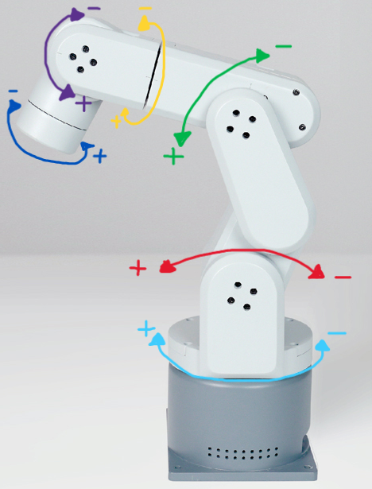

# Mecharm-270-MQTT

Programm zur Ausführung verschiedener Skills mit dem Mecharm 270-Pi Roboter-Arm von Elephant Robotics.  
Dies ist ein 6-Achsen-Roboter mit integriertem Raspberry Pi 4B.  

Weiterleitung zu 
<a href="https://docs.elephantrobotics.com/docs/gitbook-en/2-serialproduct/2.6-mecharm_270/2.6.1-mechArm.html">mechArm 270-Pi</a>.  

Dieser Mecharm ist mit einer Vakuum-Pumpe
(<a href="https://docs.elephantrobotics.com/docs/gitbook-en/2-serialproduct/2.7-accessories/2.7.2%20pump/2.7.2.1-pump.html">Vertical Suction Pump</a>)
ausgerüstet, um einen Einkaufschip aufzuheben.

## Skills

| Skill                 | Beschreibung |
|-----------------------|---|
| home                  | Fährt auf den Ausgangszustand mit Koordinaten [ 0, 0, 0, 0, 0, 0 ] |
| grip                  | Schaltet die Vakuum-Pumpe an |
| release               | Schaltet die Vakuum-Pumpe aus |
| pickupFromConveyor1   | Nimmt den Chip von Förderband 1 auf |
| placeToConveyor1      | Legt den Chip auf Förderband 1 ab |
| pickupFromConveyor2   | Nimmt den Chip von Förderband 2 auf |
| placeToConveyor2      | Legt den Chip auf Förderband 2 ab |
| pickupFromLaser       | Nimmt den Chip aus der Laservorrichtung |
| placeToLaser          | Legt den Chip in die Laservorrichtung |
| pickupFromChipFlipper | Nimmt den Chip aus der Dreh-Vorrichtung raus |
| placeToChipFlipper    | Legt den Chip in die Dreh-Vorrichtung ab |
| release_servos        | Deaktiviert alle Servos des Roboter und macht diesen dadurch frei beweglich | 
| get_angles            | Zeigt die aktuellen Positions-Winkel des Roboter-Armes an | 
| move_angle | Bewegt ein einzelnes Gelenk des Roboter-Armes |  


---
Bevor das Skript ``main_service.py`` ausgeführt werden kann muss noch eine .env-Datei angelegt werden.  
In die .env Datei die folgenden Variablen eintragen:

````python
MQTT_BROKER=  
MQTT_PORT=
MQTT_USER=  
MQTT_PASS=  
SERIAL_PORT=/dev/ttyAMA0
BAUD=1000000  
VACUUM_ON_PIN=20  
VACUUM_OFF_PIN=21
````

## MQTT Topics:

````python
TOPIC_CMD = "mecharm/command"
TOPIC_STATUS = "mecharm/status"
TOPIC_CONNECTION = "mecharm/connection"
````

## Winkel des Mecharm 270 PI



| Angles                                                                                                                                                                                                                                                                | Coords                                                                                                                                                                                                                                  |
|-----------------------------------------------------------------------------------------------------------------------------------------------------------------------------------------------------------------------------------------------------------------------|-----------------------------------------------------------------------------------------------------------------------------------------------------------------------------------------------------------------------------------------|
| <div contenteditable>[ <span style="color: lightblue;">J1</span> <span style="color: red;">J2</span> <span style="color: green;">J3</span> <span style="color: yellow;">J4</span> <span style="color: purple;">J5</span> <span style="color: blue;">J6</span> ]</div> | [ <span style="color: lightblue;">X</span> <span style="color: red;">Y</span> <span style="color: green;">Z</span> <span style="color: yellow;">Rx</span> <span style="color: purple;">Ry</span> <span style="color: blue;">Rz</span> ] |


| Gelenk  |    Bezeichnung    |  Wertebereich in Grad (°)  |
|:-------:|:-----------------:|:--------------------------:|
|   J1    |       Base        |         -160 ~ 160         |
|   J2    |     Shoulder      |         -75 ~ 120          |
|   J3    |       Elbow       |         -175 ~ 65          |
|   J4    |    Wrist Pist     |         -155 ~ 155         |
|   J5    |    Wrist Roll     |         -115 ~ 115         |
|   J6    | Gripper Rotation  |         -180 ~ 180         |